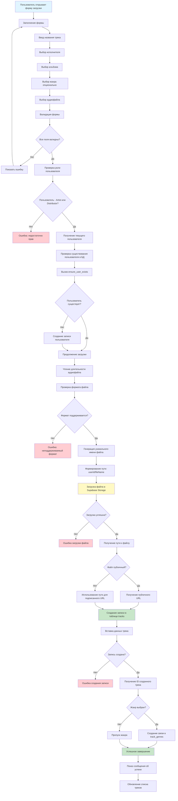

# Блок-схемы алгоритмов ImperialTunes

Данный документ содержит блок-схемы основных алгоритмов работы приложения ImperialTunes.

---

## 1. Алгоритм воспроизведения трека

### Описание
Алгоритм описывает процесс воспроизведения музыкального трека: от выбора трека пользователем до его воспроизведения и логирования истории прослушивания.

```mermaid
flowchart TD
    A[Пользователь выбирает трек] --> B{Трек выбран?}
    B -->|Нет| C[Ожидание выбора]
    B -->|Да| D[PlayerContext устанавливает currentTrack]
    
    D --> E[MusicPlayer получает track]
    E --> F[Загрузка трека loadTrack]
    
    F --> G[Получение URL трека track_audio_url]
    G --> H{URL начинается с http?}
    
    H -->|Да| I[Проверка доступности публичного URL]
    I --> J{URL доступен?}
    J -->|Да| K[Использование публичного URL]
    J -->|Нет| L[Извлечение пути из URL]
    
    H -->|Нет| L
    L --> M[Получение подписанного URL через createSignedUrl]
    M --> N{Успешно?}
    N -->|Нет| O[Ошибка: невозможно загрузить аудио]
    N -->|Да| P[Установка audioUrl]
    
    K --> P
    P --> Q[Установка URL в audio элемент]
    Q --> R[Ожидание события canplay]
    
    R --> S[Автовоспроизведение трека]
    S --> T{Автовоспроизведение разрешено?}
    T -->|Нет| U[Ожидание действия пользователя]
    T -->|Да| V[Начало воспроизведения]
    
    U --> W[Пользователь нажимает Play]
    W --> V
    
    V --> X[Установка isPlaying = true]
    X --> Y[Запуск отслеживания времени]
    Y --> Z[Через 5 секунд: проверка прослушивания]
    
    Z --> AA{Прослушано >= 5 сек?}
    AA -->|Да| AB{playCount засчитан?}
    AA -->|Нет| AC[Продолжение воспроизведения]
    
    AB -->|Нет| AD[incrementPlayCount трека]
    AD --> AE[Установка флага playCountLogged]
    AE --> AC
    
    AB -->|Да| AC
    AC --> AF[Обновление currentTime каждую секунду]
    AF --> AG{Трек завершен?}
    
    AG -->|Нет| AH{Режим repeat?}
    AH -->|none| AC
    AH -->|one| AI[Повтор текущего трека]
    AH -->|all| AJ[Переход к следующему треку]
    
    AG -->|Да| AK[Завершение прослушивания]
    AK --> AL{playCount засчитан?}
    AL -->|Нет| AM[incrementPlayCount]
    AL -->|Да| AN[Логирование в listening_history]
    AM --> AN
    
    AN --> AO[Запись completed = true]
    AO --> AP{Режим repeat?}
    
    AP -->|one| AI
    AP -->|all| AJ
    AP -->|none| AQ{Есть следующий трек?}
    
    AQ -->|Да| AJ
    AQ -->|Нет| AR[Остановка воспроизведения]
    
    AI --> V
    AJ --> AS[PlayerContext.nextTrack]
    AS --> E
    
    style A fill:#e1f5ff
    style V fill:#c8e6c9
    style O fill:#ffcdd2
    style AR fill:#fff9c4
```

---

## 2. Алгоритм загрузки трека

### Описание
Алгоритм описывает процесс загрузки музыкального трека пользователем: от выбора файла до сохранения в базе данных и хранилище.

---

## 3. Алгоритм управления плейлистом

### Описание
Алгоритм описывает процесс создания плейлиста и добавления треков в плейлист.

```mermaid
flowchart TD
    A[Пользователь создает плейлист] --> B[Заполнение формы плейлиста]
    B --> C[Ввод названия плейлиста]
    C --> D[Ввод описания опционально]
    D --> E[Загрузка обложки опционально]
    E --> F[Выбор видимости публичная/приватная]
    
    F --> G[Валидация данных]
    G --> H{Название валидно?}
    H -->|Нет| I[Ошибка: название должно быть 2-100 символов]
    I --> B
    
    H -->|Да| J[Проверка авторизации]
    J --> K{Пользователь авторизован?}
    K -->|Нет| L[Ошибка: требуется авторизация]
    K -->|Да| M[Получение текущего пользователя]
    
    M --> N[Проверка существования пользователя]
    N --> O[Вызов ensure_user_exists]
    O --> P[Создание записи в таблице playlists]
    P --> Q{Запись создана?}
    
    Q -->|Нет| R[Ошибка создания плейлиста]
    Q -->|Да| S[Получение ID плейлиста]
    S --> T[Успешное создание плейлиста]
    
    T --> U[Пользователь добавляет трек в плейлист]
    U --> V[Выбор трека из списка]
    V --> W[Получение ID плейлиста и ID трека]
    
    W --> X[Проверка существования связи]
    X --> Y{Трек уже в плейлисте?}
    Y -->|Да| Z[Ошибка: трек уже добавлен]
    Y -->|Нет| AA[Получение максимального order_position]
    
    AA --> AB[Вычисление следующего order_position]
    AB --> AC[Создание записи в playlist_tracks]
    AC --> AD{Запись создана?}
    
    AD -->|Нет| AE[Ошибка добавления трека]
    AD -->|Да| AF[Успешное добавление трека]
    AF --> AG[Обновление списка треков плейлиста]
    
    AG --> AH[Пользователь воспроизводит плейлист]
    AH --> AI[Загрузка всех треков плейлиста]
    AI --> AJ[Установка плейлиста в PlayerContext]
    AJ --> AK[Установка первого трека как currentTrack]
    AK --> AL[Начало воспроизведения]
    
    AL --> AM{Режим Shuffle включен?}
    AM -->|Да| AN[Перемешивание плейлиста]
    AM -->|Нет| AO[Использование исходного порядка]
    
    AN --> AP[Создание shuffledPlaylist]
    AP --> AQ[Воспроизведение треков]
    AO --> AQ
    
    AQ --> AR{Трек завершен?}
    AR -->|Да| AS[Переход к следующему треку]
    AR -->|Нет| AQ
    
    AS --> AT{Есть следующий трек?}
    AT -->|Да| AU[Установка следующего трека]
    AT -->|Нет| AV[Завершение воспроизведения плейлиста]
    
    AU --> AQ
    
    style A fill:#e1f5ff
    style P fill:#c8e6c9
    style AC fill:#c8e6c9
    style T fill:#c8e6c9
    style AF fill:#c8e6c9
    style I fill:#ffcdd2
    style L fill:#ffcdd2
    style R fill:#ffcdd2
    style Z fill:#ffcdd2
    style AE fill:#ffcdd2
```

---

## 4. Алгоритм отслеживания прослушивания и обновления счетчиков

### Описание
Алгоритм описывает процесс логирования прослушиваний треков и обновления счетчиков прослушиваний в базе данных.

```mermaid
flowchart TD
    A[Начало воспроизведения трека] --> B[Установка playCountLoggedRef = null]
    B --> C[Запуск таймера на 5 секунд]
    C --> D[Воспроизведение трека]
    
    D --> E{Прошло 5 секунд?}
    E -->|Нет| F[Продолжение воспроизведения]
    E -->|Да| G{Трек все еще воспроизводится?}
    
    G -->|Нет| F
    G -->|Да| H{currentTime >= 5 секунд?}
    H -->|Нет| F
    H -->|Да| I{playCount уже засчитан?}
    
    I -->|Да| F
    I -->|Нет| J[Вызов incrementPlayCount]
    J --> K[Получение текущего track_play_count]
    K --> L[Увеличение счетчика на 1]
    L --> M[Обновление tracks.track_play_count]
    M --> N{Обновление успешно?}
    
    N -->|Нет| O[Ошибка обновления счетчика]
    N -->|Да| P[Установка playCountLoggedRef = track.id]
    P --> F
    
    F --> Q{Пользователь ставит на паузу?}
    Q -->|Да| R{currentTime >= 5 секунд?}
    Q -->|Нет| S{Трек завершен?}
    
    R -->|Да| T{playCount засчитан?}
    R -->|Нет| U[Логирование без playCount]
    
    T -->|Нет| V[incrementPlayCount]
    T -->|Да| W[Вызов logListening]
    V --> W
    
    W --> X[Получение пользователя]
    X --> Y{Пользователь авторизован?}
    Y -->|Нет| Z[Пропуск логирования]
    Y -->|Да| AA[Вычисление duration_played]
    
    AA --> AB{duration_played >= 1 секунда?}
    AB -->|Нет| Z
    AB -->|Да| AC[Вставка записи в listening_history]
    
    AC --> AD{Запись создана?}
    AD -->|Нет| AE[Ошибка логирования]
    AD -->|Да| AF{playCount уже засчитан через incrementPlayCount?}
    
    AF -->|Да| AG[Триггер БД увеличил счетчик еще раз]
    AG --> AH[Получение текущего track_play_count]
    AH --> AI[Уменьшение счетчика на 1]
    AI --> AJ[Корректировка счетчика]
    
    AF -->|Нет| AK[Триггер увеличил счетчик - это нормально]
    AK --> AL[Установка playCountLoggedRef = track.id]
    AJ --> AL
    U --> W
    
    S -->|Да| AM[Завершение трека]
    S -->|Нет| F
    
    AM --> AN{playCount засчитан?}
    AN -->|Нет| AO[incrementPlayCount]
    AN -->|Да| AP[Вызов logListening с completed = true]
    AO --> AP
    
    AP --> AQ[Получение полной длительности трека]
    AQ --> AR[Логирование с duration_played = duration]
    AR --> AS[Установка completed = true]
    AS --> AT[Вставка в listening_history]
    
    AT --> AU{Запись создана?}
    AU -->|Нет| AV[Ошибка логирования]
    AU -->|Да| AW{playCount уже засчитан?}
    
    AW -->|Да| AX[Корректировка счетчика если нужно]
    AW -->|Нет| AY[Триггер увеличил счетчик]
    AX --> AZ[Завершение логирования]
    AY --> AZ
    AL --> AZ
    
    AZ --> BA[Остановка периодического логирования]
    BA --> BB[Сброс lastLoggedTimeRef]
    BB --> BC[Конец алгоритма]
    
    style A fill:#e1f5ff
    style J fill:#fff9c4
    style M fill:#c8e6c9
    style AC fill:#c8e6c9
    style AT fill:#c8e6c9
    style AZ fill:#c8e6c9
    style O fill:#ffcdd2
    style AE fill:#ffcdd2
    style AV fill:#ffcdd2
```

---

## Примечания к алгоритмам

### Алгоритм 1: Воспроизведение трека
- **Ключевые компоненты**: `MusicPlayer`, `PlayerContext`, `HTML5 Audio API`
- **Особенности**: 
  - Поддержка публичных и приватных URL
  - Автоматическое получение подписанных URL для приватных файлов
  - Отслеживание прослушивания с задержкой 5 секунд
  - Поддержка режимов повторения (none, one, all)
  - Поддержка перемешивания плейлиста

### Алгоритм 2: Загрузка трека
- **Ключевые компоненты**: `UploadTrackDialog`, `Supabase Storage`, `tracks table`
- **Особенности**:
  - Проверка прав доступа (только Artist/Distributor)
  - Валидация формата и размера файла
  - Автоматическое создание пользователя если необходимо
  - Поддержка публичных и приватных файлов
  - Связывание с жанрами через таблицу track_genres

### Алгоритм 3: Управление плейлистом
- **Ключевые компоненты**: `CreatePlaylistDialog`, `AddSongToPlaylistDialog`, `PlayerContext`
- **Особенности**:
  - Валидация названия плейлиста (2-100 символов)
  - Проверка дубликатов при добавлении треков
  - Автоматическое вычисление order_position
  - Поддержка перемешивания плейлиста
  - Автоматический переход между треками

### Алгоритм 4: Отслеживание прослушивания
- **Ключевые компоненты**: `MusicPlayer`, `listening_history table`, триггер БД
- **Особенности**:
  - Защита от двойного начисления play_count
  - Логирование только после 5 секунд прослушивания
  - Отдельное логирование при паузе и завершении
  - Корректировка счетчика при дублировании триггером
  - Поддержка незавершенных прослушиваний

---

## Используемые технологии

- **Frontend**: React, TypeScript, Vite
- **Backend**: Supabase (PostgreSQL, Storage)
- **Аудио**: HTML5 Audio API
- **Состояние**: React Context API

---

*Документ создан на основе анализа кодовой базы ImperialTunes*

